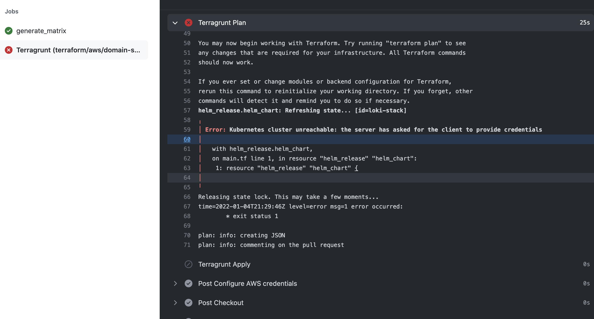

# Granting Permissions to EKS

After applying this module to create the AWS Identity providers and roles, theres more to be done in
order for your Github Actions pipeline to have permissions to an EKS cluster.  You will need to
give permission to this role to the EKS cluster.

How to identify what the problem is.

# Your pipeline runs and fails
When the pipeline is trying to reach out to the EKS cluster, it fails to authenticate.



You can look at the `CloudWatch` logs and determine what it failed on.  
Go to in the AWS console: `cloudwatch -> Log Group -> <cluster> -> authenticator-xxx logs`

Search for the word denied  and something like this will come up:
```
time="2022-01-04T21:29:45Z" level=warning msg="access denied" arn="arn:aws:iam::xxxx:role/github_oidc" client="127.0.0.1:34720" error="ARN is not mapped: arn:aws:iam::xxxx:role/github_oidc" method=POST path=/authenticate sts=sts.amazonaws.com
```

This means that your EKS cluster don't have this role mapped and dont know it should trust it.

You will need to add this into your EKS cluster's role map.

If you are using `kubernetes-ops`' EKS Terraform module, you can add it here: https://github.com/ManagedKube/kubernetes-ops/blob/main/terraform-modules/aws/eks/variables.tf#L53

It will be similar to the based Terraform EKS module and add in:

```
[
    {
      rolearn  = "arn:aws:iam::xxxx:role/github_oidc"
      username = "github"
      groups   = ["system:masters"]
    },
]
```

Apply this and your cluster will allow this AWS IAM role perform actions on the EKS cluster.
